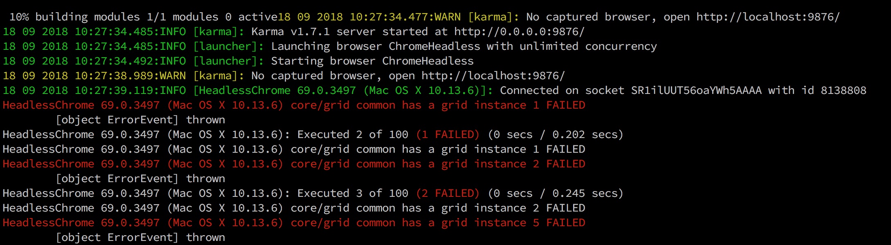

# About
This repository reproduces the behaviour discussed in the following issue https://github.com/ag-grid/ag-grid/issues/2588

# Installation

```sh
git clone git@github.com:giniedp/ag-grid-ro-issue.git
cd ag-grid-ro-issue
npm install
```

# Running the tests on Chrome browser

Change the `browsers` option `karma.config.js` to

```js
browsers: [ "Chrome" ],
```

Now run 

```sh
npm run test
```

The output


In the above output 44 of 100 tests failed. This number is not consistent.

# Running tests on Chrome headless browser

Change the `browsers` option `karma.config.js` to

```js
browsers: [ "ChromeHeadless" ],
```

Now run 

```sh
npm run test
```

The output




In the above output 54 of 100 tests failed. This number is not consistent.

# Observation 1

The output shows `[object ErrorEvent] thrown`. That is because jasmine does not know how to report an `ErrorEvent` object. To see the actual error you can change the file in 
`node_modules/jasmine-core/lib/jasmine-core/jasmine.js`
change lines 2283-228s from

```js
if (error.name && error.message) {
  message += error.name + ': ' + error.message;
} else {
  message += error.toString() + ' thrown';
}
```

to 

```js
if (error.name && error.message) {
  message += error.name + ': ' + error.message;
} else if (error.message) {
  message += error.message;
} else {
  message += error.toString() + ' thrown';
}
```

to reveal the error message


# Observation 2

Reducing the number of columns in `grid.directive.spec` gets rid of the error. In Chrome sooner as in Chrome Headless. That is for sure because chrome headless has less screen space so ag-grid has to perform column layout much earlier.
